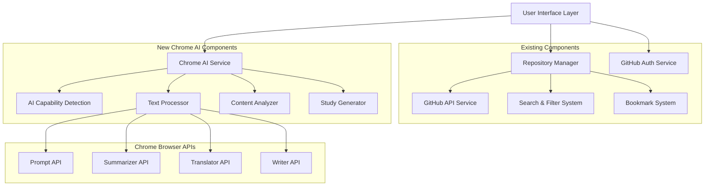
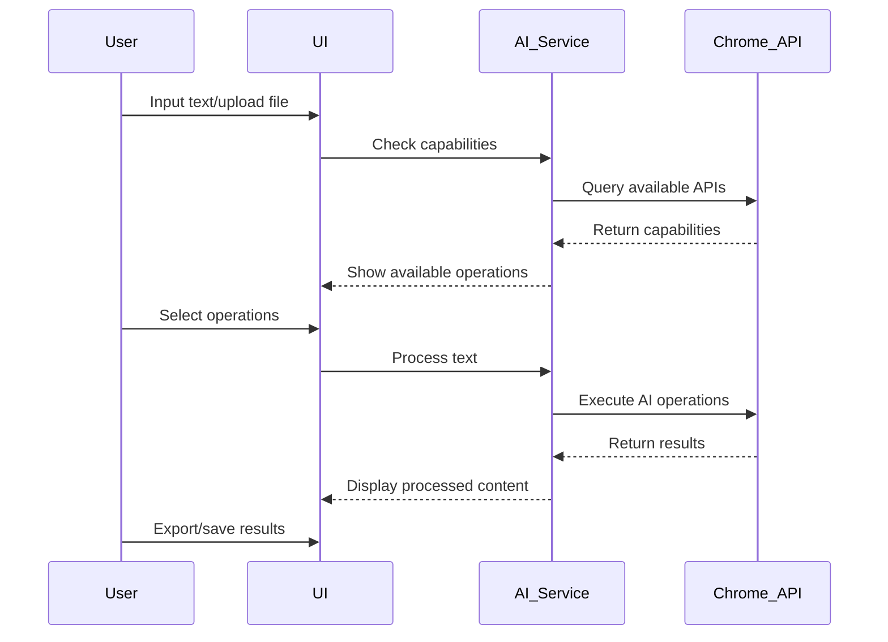

# Design Document

## Overview

The Enhanced TechHub Research Platform design integrates Chrome's built-in AI APIs (Gemini Nano) into the existing GitHub repository analysis platform. The design preserves all current functionality while adding a new research simplification module that can process various types of text content including repository documentation, research papers, and policy documents.

## Architecture

### High-Level Architecture



### Integration Strategy

The new Chrome AI features will be integrated as an additional module alongside existing functionality:

1. **Non-Intrusive Integration**: Chrome AI features are added as new components without modifying existing repository analysis code
2. **Progressive Enhancement**: AI features enhance the existing experience when available, with graceful fallbacks
3. **Modular Design**: AI components can be independently developed and tested
4. **Shared UI Patterns**: New AI features follow existing design patterns and component library

## Components and Interfaces

### 1. Chrome AI Service (`src/services/chromeAiService.ts`)

Central service for managing Chrome AI API interactions:

```typescript
interface ChromeAiService {
  // Capability detection
  checkAiAvailability(): Promise<AiCapabilities>
  
  // Text processing operations
  summarizeText(text: string, options: SummaryOptions): Promise<string>
  simplifyText(text: string, level: ComplexityLevel): Promise<string>
  translateText(text: string, targetLanguage: string): Promise<string>
  proofreadText(text: string): Promise<ProofreadResult>
  generateStudyQuestions(text: string, questionTypes: QuestionType[]): Promise<StudyQuestion[]>
}

interface AiCapabilities {
  promptApi: boolean
  summarizer: boolean
  translator: boolean
  writer: boolean
  supportedLanguages: string[]
}
```

### 2. Research Simplifier Component (`src/components/ResearchSimplifier.tsx`)

Main UI component for Chrome AI features:

```typescript
interface ResearchSimplifierProps {
  initialText?: string
  onTextProcessed?: (result: ProcessedText) => void
  className?: string
}

interface ProcessedText {
  original: string
  summary?: string
  simplified?: string
  translated?: string
  proofread?: ProofreadResult
  studyQuestions?: StudyQuestion[]
}
```

### 3. AI Text Processor Hook (`src/hooks/useAiTextProcessor.ts`)

React hook for managing text processing operations:

```typescript
interface UseAiTextProcessor {
  processText: (text: string, operations: ProcessingOperation[]) => Promise<ProcessedText>
  isProcessing: boolean
  error: string | null
  capabilities: AiCapabilities | null
}
```

### 4. Content Input Component (`src/components/ContentInput.tsx`)

Handles various input methods for content:

```typescript
interface ContentInputProps {
  onContentLoaded: (content: string, metadata: ContentMetadata) => void
  supportedFormats: FileFormat[]
  maxSize: number
}

interface ContentMetadata {
  type: 'pdf' | 'text' | 'url' | 'repository'
  source: string
  title?: string
  language?: string
}
```

## Data Models

### Text Processing Models

```typescript
interface SummaryOptions {
  length: 'brief' | 'detailed' | 'comprehensive'
  format: 'bullets' | 'paragraph' | 'outline'
  focusAreas?: string[]
}

interface ComplexityLevel {
  level: 'elementary' | 'high-school' | 'undergraduate' | 'graduate'
  preserveTechnicalTerms: boolean
  includeDefinitions: boolean
}

interface ProofreadResult {
  correctedText: string
  suggestions: Suggestion[]
  metrics: {
    readabilityScore: number
    grammarIssues: number
    styleIssues: number
  }
}

interface Suggestion {
  type: 'grammar' | 'style' | 'clarity' | 'word-choice'
  original: string
  suggested: string
  explanation: string
  position: { start: number; end: number }
}

interface StudyQuestion {
  id: string
  type: 'multiple-choice' | 'short-answer' | 'essay' | 'true-false'
  question: string
  options?: string[]
  correctAnswer?: string
  explanation?: string
  difficulty: 'easy' | 'medium' | 'hard'
  topic: string
}
```

### Integration Models

```typescript
interface RepositoryContent {
  repository: Repository
  readme?: string
  documentation?: string[]
  codeFiles?: CodeFile[]
}

interface CodeFile {
  path: string
  content: string
  language: string
  size: number
}
```

## User Interface Design

### 1. Research Simplifier Panel

A new collapsible panel that can be accessed from:
- Repository details dialog (for processing README/docs)
- Main navigation (for general text processing)
- Floating action button (mobile)

### 2. Processing Workflow



### 3. UI Integration Points

- **Repository Details**: Add "Simplify Documentation" button
- **Search Results**: Add AI-powered content preview
- **Sidebar**: New "Research Tools" section
- **Settings**: Chrome AI preferences and language settings

## Error Handling

### 1. Chrome AI Availability

```typescript
enum AiErrorType {
  NOT_SUPPORTED = 'not_supported',
  NOT_AVAILABLE = 'not_available',
  QUOTA_EXCEEDED = 'quota_exceeded',
  PROCESSING_ERROR = 'processing_error',
  NETWORK_ERROR = 'network_error'
}

interface AiErrorHandler {
  handleError(error: AiErrorType, context: string): void
  showFallbackOptions(operation: ProcessingOperation): void
  retryWithBackoff(operation: () => Promise<any>, maxRetries: number): Promise<any>
}
```

### 2. Graceful Degradation

- Show clear messages when Chrome AI is not available
- Provide alternative processing options (external APIs as fallback)
- Maintain full functionality of existing features regardless of AI availability

### 3. Content Processing Errors

- Handle large content by chunking
- Provide partial results when processing fails
- Clear error messages with suggested solutions

## Testing Strategy

### 1. Chrome AI Integration Tests

```typescript
describe('Chrome AI Service', () => {
  test('detects AI capabilities correctly')
  test('handles API unavailability gracefully')
  test('processes text with different operations')
  test('manages rate limiting and quotas')
  test('handles large content chunking')
})
```

### 2. Component Integration Tests

```typescript
describe('Research Simplifier Component', () => {
  test('renders with existing repository content')
  test('processes multiple text operations')
  test('exports results in various formats')
  test('maintains state during processing')
})
```

### 3. Existing Functionality Regression Tests

```typescript
describe('Existing Platform Features', () => {
  test('repository search remains functional')
  test('GitHub authentication works correctly')
  test('bookmarking and comparison features work')
  test('all existing UI components render properly')
})
```

### 4. Browser Compatibility Tests

- Test Chrome AI availability detection
- Verify fallback behavior in non-Chrome browsers
- Test progressive enhancement approach

## Performance Considerations

### 1. Lazy Loading

- Load Chrome AI components only when needed
- Defer AI capability detection until first use
- Implement code splitting for AI-related modules

### 2. Content Processing Optimization

- Implement text chunking for large documents
- Use streaming for real-time processing feedback
- Cache processed results to avoid reprocessing

### 3. Memory Management

- Clean up AI sessions after processing
- Implement proper cleanup for file uploads
- Monitor memory usage during large document processing

## Security Considerations

### 1. Content Privacy

- All processing happens locally in Chrome (no external API calls)
- Implement content sanitization for uploaded files
- Clear sensitive content from memory after processing

### 2. File Upload Security

- Validate file types and sizes
- Implement virus scanning for uploaded files
- Sanitize extracted text content

### 3. API Usage

- Respect Chrome AI API rate limits
- Implement proper error handling for API failures
- Monitor API usage patterns

## Implementation Phases

### Phase 1: Core Infrastructure
- Chrome AI capability detection
- Basic text processing service
- Simple UI integration

### Phase 2: Advanced Features
- Multiple processing operations
- File upload and processing
- Export functionality

### Phase 3: Repository Integration
- Process repository documentation
- Enhanced search with AI summaries
- Batch processing capabilities

### Phase 4: Advanced UI/UX
- Real-time processing feedback
- Advanced export options
- Mobile optimization