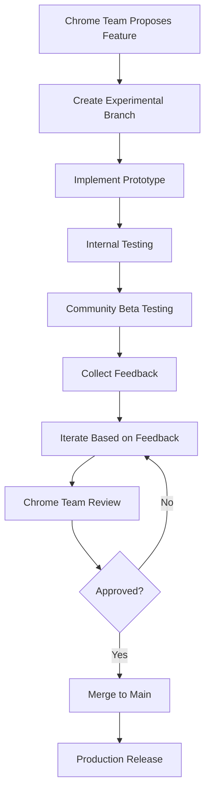

# 🌿 GitHub Experimental Branch Strategy

## Overview

This document outlines our strategy for managing experimental Chrome AI features in a dedicated GitHub branch, facilitating collaboration with the Chrome team and community testing of cutting-edge AI capabilities.

---

## 🎯 Branch Structure

### Main Branches
```
main
├── Production-ready features
├── Stable Chrome AI implementations
├── Comprehensive documentation
└── Full test coverage

experimental/chrome-ai-advanced
├── Beta Chrome AI features
├── Experimental API implementations
├── Performance optimizations
├── Advanced UX patterns
└── Community feedback integration

experimental/chrome-ai-bleeding-edge
├── Unreleased Chrome AI APIs
├── Prototype implementations
├── Research and development
└── Chrome team collaboration features
```

---

## 🚀 Experimental Features Pipeline

### Phase 1: Research & Prototyping
**Branch**: `experimental/chrome-ai-bleeding-edge`

**Features in Development**:
1. **Real-Time Proofreading API**
   ```typescript
   // As-you-type grammar checking
   const realtimeProofreader = await window.ai.realtimeProofreader.create({
     debounceMs: 500,
     minLength: 10,
     maxSuggestions: 5
   });
   
   realtimeProofreader.onSuggestion((suggestion) => {
     // Update UI with live suggestions
     updateInlineUI(suggestion);
   });
   ```

2. **Batch Processing API**
   ```typescript
   // Process multiple operations efficiently
   const batch = await window.ai.batch.create();
   const results = await batch.processAll([
     { operation: 'summarize', text: doc1, options: { length: 'brief' } },
     { operation: 'proofread', text: doc2, options: { style: 'academic' } },
     { operation: 'translate', text: doc3, options: { target: 'es' } }
   ]);
   ```

3. **Code Analysis API**
   ```typescript
   // Analyze code quality and generate documentation
   const codeAnalyzer = await window.ai.codeAnalyzer.create({
     language: 'typescript',
     framework: 'react',
     style: 'airbnb'
   });
   
   const analysis = await codeAnalyzer.analyze(sourceCode, {
     checkQuality: true,
     generateDocs: true,
     suggestRefactoring: true,
     findSecurityIssues: true
   });
   ```

4. **Streaming Response API**
   ```typescript
   // Stream AI responses for better UX
   const stream = await window.ai.promptApi.createStream();
   
   for await (const chunk of stream.prompt(longPrompt)) {
     updateProgressiveUI(chunk);
   }
   ```

### Phase 2: Beta Testing
**Branch**: `experimental/chrome-ai-advanced`

**Features Ready for Testing**:
1. **Enhanced Proofreading Studio**
2. **Multi-Document Processor**
3. **AI-Powered Code Review**
4. **Smart Content Generator**
5. **Advanced Analytics Dashboard**

### Phase 3: Production Candidate
**Branch**: `main` (after thorough testing)

---

## 🔬 Experimental Feature Categories

### 1. **Performance Enhancements**
```typescript
// WebWorker integration for heavy processing
class ChromeAiWorkerService {
  private worker: Worker;
  
  async processInBackground(operation: AiOperation): Promise<Result> {
    return new Promise((resolve, reject) => {
      this.worker.postMessage({ operation });
      this.worker.onmessage = (event) => {
        if (event.data.success) {
          resolve(event.data.result);
        } else {
          reject(event.data.error);
        }
      };
    });
  }
}
```

### 2. **Advanced UI Patterns**
```typescript
// Progressive enhancement with AI
export const ProgressiveAiTextarea: React.FC = () => {
  const [suggestions, setSuggestions] = useState<Suggestion[]>([]);
  const [isAiEnabled, setIsAiEnabled] = useState(false);
  
  useEffect(() => {
    // Check AI availability and enable features progressively
    ChromeAiService.checkAiAvailability().then(capabilities => {
      setIsAiEnabled(capabilities.proofreader || capabilities.promptApi);
    });
  }, []);
  
  return (
    <div className="relative">
      <Textarea {...props} />
      {isAiEnabled && (
        <AiSuggestionsOverlay suggestions={suggestions} />
      )}
    </div>
  );
};
```

### 3. **Privacy-First Analytics**
```typescript
// Local analytics without data collection
class PrivacyFirstAnalytics {
  private metrics: LocalMetrics = {};
  
  trackAiUsage(operation: string, duration: number, success: boolean) {
    // Store locally, never send to servers
    const key = `ai_${operation}_${new Date().toDateString()}`;
    this.metrics[key] = {
      count: (this.metrics[key]?.count || 0) + 1,
      avgDuration: this.calculateAverage(duration),
      successRate: this.calculateSuccessRate(success)
    };
    
    // Store in localStorage for persistence
    localStorage.setItem('ai_metrics', JSON.stringify(this.metrics));
  }
}
```

---

## 🧪 Testing Strategy

### Automated Testing
```typescript
// Chrome AI integration tests
describe('Chrome AI Experimental Features', () => {
  beforeEach(async () => {
    // Mock Chrome AI APIs for testing
    global.window.ai = createMockChromeAi();
  });
  
  describe('Real-time Proofreading', () => {
    it('should provide suggestions as user types', async () => {
      const proofreader = new RealtimeProofreader();
      const suggestions = await proofreader.getSuggestions('This have errors');
      
      expect(suggestions).toContainEqual({
        type: 'grammar',
        original: 'have',
        suggested: 'has',
        position: { start: 5, end: 9 }
      });
    });
  });
  
  describe('Batch Processing', () => {
    it('should process multiple operations efficiently', async () => {
      const batch = new BatchProcessor();
      const results = await batch.process([
        { type: 'summarize', text: 'Long text...' },
        { type: 'proofread', text: 'Text with errors...' }
      ]);
      
      expect(results).toHaveLength(2);
      expect(results[0].type).toBe('summary');
      expect(results[1].type).toBe('proofread');
    });
  });
});
```

### Manual Testing Protocol
1. **Feature Flags**: Enable/disable experimental features
2. **A/B Testing**: Compare experimental vs stable implementations
3. **User Feedback**: Collect detailed feedback on experimental features
4. **Performance Monitoring**: Track metrics for experimental features
5. **Error Reporting**: Comprehensive error tracking and reporting

### Community Testing Program
```markdown
## Beta Tester Requirements
- Chrome Canary or Dev channel
- Enabled Chrome AI flags
- Willingness to provide detailed feedback
- Understanding of experimental nature

## Testing Process
1. Join experimental branch testing program
2. Enable feature flags for experimental features
3. Use features in real-world scenarios
4. Report bugs and provide feedback
5. Participate in feedback sessions
```

---

## 📊 Metrics & Monitoring

### Performance Metrics
```typescript
interface ExperimentalMetrics {
  featureName: string;
  usageCount: number;
  averageProcessingTime: number;
  successRate: number;
  errorRate: number;
  userSatisfaction: number;
  feedbackCount: number;
  adoptionRate: number;
}

class ExperimentalMetricsCollector {
  private metrics: Map<string, ExperimentalMetrics> = new Map();
  
  trackFeatureUsage(featureName: string, startTime: number, success: boolean) {
    const duration = Date.now() - startTime;
    const current = this.metrics.get(featureName) || this.createEmptyMetrics(featureName);
    
    current.usageCount++;
    current.averageProcessingTime = this.updateAverage(current.averageProcessingTime, duration, current.usageCount);
    current.successRate = this.updateSuccessRate(current.successRate, success, current.usageCount);
    
    this.metrics.set(featureName, current);
  }
  
  generateReport(): ExperimentalReport {
    return {
      timestamp: new Date().toISOString(),
      features: Array.from(this.metrics.values()),
      summary: this.generateSummary()
    };
  }
}
```

### User Feedback Collection
```typescript
// In-app feedback system for experimental features
export const ExperimentalFeatureFeedback: React.FC<{ featureName: string }> = ({ featureName }) => {
  const [feedback, setFeedback] = useState('');
  const [rating, setRating] = useState(0);
  
  const submitFeedback = async () => {
    // Store feedback locally (privacy-first)
    const feedbackData = {
      feature: featureName,
      rating,
      feedback,
      timestamp: new Date().toISOString(),
      userAgent: navigator.userAgent,
      chromeVersion: getChromeVersion()
    };
    
    // Store in localStorage for later analysis
    const existingFeedback = JSON.parse(localStorage.getItem('experimental_feedback') || '[]');
    existingFeedback.push(feedbackData);
    localStorage.setItem('experimental_feedback', JSON.stringify(existingFeedback));
    
    toast({
      title: "Feedback Submitted",
      description: "Thank you for helping improve experimental features!"
    });
  };
  
  return (
    <Card className="mt-4 border-orange-200 bg-orange-50">
      <CardHeader>
        <CardTitle className="text-sm flex items-center gap-2">
          <Flask className="h-4 w-4" />
          Experimental Feature Feedback
        </CardTitle>
      </CardHeader>
      <CardContent>
        <div className="space-y-3">
          <div>
            <label className="text-sm font-medium">Rate this feature:</label>
            <div className="flex gap-1 mt-1">
              {[1, 2, 3, 4, 5].map(star => (
                <Star
                  key={star}
                  className={`h-5 w-5 cursor-pointer ${star <= rating ? 'fill-yellow-400 text-yellow-400' : 'text-gray-300'}`}
                  onClick={() => setRating(star)}
                />
              ))}
            </div>
          </div>
          <Textarea
            placeholder="Share your experience with this experimental feature..."
            value={feedback}
            onChange={(e) => setFeedback(e.target.value)}
            className="text-sm"
          />
          <Button onClick={submitFeedback} size="sm" className="w-full">
            Submit Feedback
          </Button>
        </div>
      </CardContent>
    </Card>
  );
};
```

---

## 🤝 Chrome Team Collaboration

### Communication Channels
1. **GitHub Issues**: Feature requests and bug reports
2. **Discussion Forums**: Technical discussions and feedback
3. **Regular Meetings**: Bi-weekly sync with Chrome AI team
4. **Slack/Discord**: Real-time communication
5. **Email Updates**: Weekly progress reports

### Collaboration Workflow


### Feedback Loop
1. **Weekly Reports**: Usage metrics and user feedback
2. **Monthly Reviews**: Feature performance and adoption
3. **Quarterly Planning**: Roadmap alignment and priorities
4. **Annual Summit**: In-person collaboration and planning

---

## 🔐 Security & Privacy

### Privacy-First Development
```typescript
// All experimental features maintain privacy standards
class PrivacyFirstExperimentalFeature {
  private localOnly: boolean = true;
  private dataRetention: number = 0; // No data retention
  
  async processData(data: any): Promise<any> {
    // Ensure all processing happens locally
    if (!this.localOnly) {
      throw new Error('Privacy violation: External processing not allowed');
    }
    
    // Process with Chrome AI (local)
    const result = await window.ai.processLocally(data);
    
    // Clear sensitive data immediately
    this.clearSensitiveData(data);
    
    return result;
  }
  
  private clearSensitiveData(data: any): void {
    // Implement secure data clearing
    if (typeof data === 'object') {
      Object.keys(data).forEach(key => {
        delete data[key];
      });
    }
  }
}
```

### Security Measures
1. **No External APIs**: All processing happens in browser
2. **No Data Collection**: User data never leaves the device
3. **Secure Storage**: Temporary data encrypted in memory
4. **Regular Audits**: Security reviews of experimental code
5. **Vulnerability Reporting**: Clear process for security issues

---

## 📈 Success Metrics

### Technical Metrics
```typescript
interface SuccessMetrics {
  // Performance
  averageProcessingTime: number;
  memoryUsage: number;
  cpuUsage: number;
  
  // Reliability
  successRate: number;
  errorRate: number;
  crashRate: number;
  
  // Adoption
  activeUsers: number;
  featureUsage: number;
  retentionRate: number;
  
  // Quality
  userSatisfaction: number;
  bugReports: number;
  featureRequests: number;
}
```

### Business Metrics
- **User Engagement**: Time spent with experimental features
- **Feature Adoption**: Percentage of users trying new features
- **Feedback Quality**: Detailed, actionable feedback received
- **Community Growth**: Increase in beta testers and contributors
- **Chrome AI Advancement**: Contribution to Chrome AI ecosystem

---

## 🚀 Deployment Strategy

### Feature Flags
```typescript
// Dynamic feature flag system
class ExperimentalFeatureFlags {
  private flags: Map<string, boolean> = new Map();
  
  constructor() {
    this.loadFlags();
  }
  
  isEnabled(featureName: string): boolean {
    return this.flags.get(featureName) || false;
  }
  
  enable(featureName: string): void {
    this.flags.set(featureName, true);
    this.saveFlags();
  }
  
  disable(featureName: string): void {
    this.flags.set(featureName, false);
    this.saveFlags();
  }
  
  private loadFlags(): void {
    const saved = localStorage.getItem('experimental_flags');
    if (saved) {
      const parsed = JSON.parse(saved);
      Object.entries(parsed).forEach(([key, value]) => {
        this.flags.set(key, value as boolean);
      });
    }
  }
  
  private saveFlags(): void {
    const flagsObject = Object.fromEntries(this.flags);
    localStorage.setItem('experimental_flags', JSON.stringify(flagsObject));
  }
}

// Usage in components
export const ExperimentalProofreadingStudio: React.FC = () => {
  const flags = useExperimentalFlags();
  
  return (
    <div>
      <ProofreadingStudio />
      
      {flags.isEnabled('realtime-proofreading') && (
        <RealtimeProofreadingPanel />
      )}
      
      {flags.isEnabled('batch-processing') && (
        <BatchProcessingInterface />
      )}
      
      {flags.isEnabled('code-analysis') && (
        <CodeAnalysisStudio />
      )}
    </div>
  );
};
```

### Gradual Rollout
1. **Internal Testing** (Team members only)
2. **Alpha Testing** (Selected power users)
3. **Beta Testing** (Opt-in community members)
4. **Limited Release** (Percentage of users)
5. **Full Release** (All users, stable branch)

---

## 📋 Roadmap

### Q1 2025: Foundation
- ✅ Establish experimental branch structure
- ✅ Implement feature flag system
- ✅ Create testing infrastructure
- ✅ Launch beta testing program

### Q2 2025: Advanced Features
- 🔄 Real-time proofreading implementation
- 🔄 Batch processing API integration
- 🔄 Code analysis studio development
- 🔄 Performance optimization research

### Q3 2025: Community Expansion
- 📅 Expand beta testing program
- 📅 Chrome team collaboration deepening
- 📅 Conference presentations
- 📅 Open source contributions

### Q4 2025: Production Ready
- 📅 Graduate stable features to main
- 📅 Launch next generation experimental features
- 📅 Comprehensive documentation update
- 📅 Year-end collaboration review

---

## 🎯 Call to Action

### For Chrome Team
1. **Review our experimental implementations**
2. **Provide early access to new APIs**
3. **Establish regular collaboration meetings**
4. **Share roadmap and priorities**
5. **Co-present at conferences**

### For Community
1. **Join our beta testing program**
2. **Contribute to experimental features**
3. **Provide detailed feedback**
4. **Share use cases and ideas**
5. **Help spread the word**

### For Developers
1. **Explore our experimental branch**
2. **Learn from our implementations**
3. **Contribute improvements**
4. **Build on our foundations**
5. **Share your own experiments**

---

## 📞 Get Involved

### Beta Testing Program
- **Sign up**: [Beta Testing Form]
- **Requirements**: Chrome Canary + AI flags enabled
- **Commitment**: Weekly testing + feedback
- **Benefits**: Early access + direct input on features

### Developer Collaboration
- **GitHub**: Fork experimental branch
- **Discord**: Join developer discussions
- **Meetings**: Monthly community calls
- **Contributions**: Code, docs, ideas welcome

### Chrome Team Partnership
- **Contact**: [Partnership Email]
- **Proposal**: Review CHROME_EXPERIMENTAL.md
- **Meeting**: Schedule collaboration discussion
- **Goals**: Advance Chrome AI ecosystem together

---

**Let's build the future of browser-based AI together!** 🚀

*The experimental branch is where innovation happens. Join us in pushing the boundaries of what's possible with Chrome AI.*

---

**Repository**: [GitHub Experimental Branch]  
**Documentation**: Complete guides in `/docs`  
**Community**: [Discord/Slack Channel]  
**Contact**: [Team Email]

*Last updated: November 1, 2025*